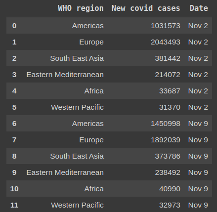
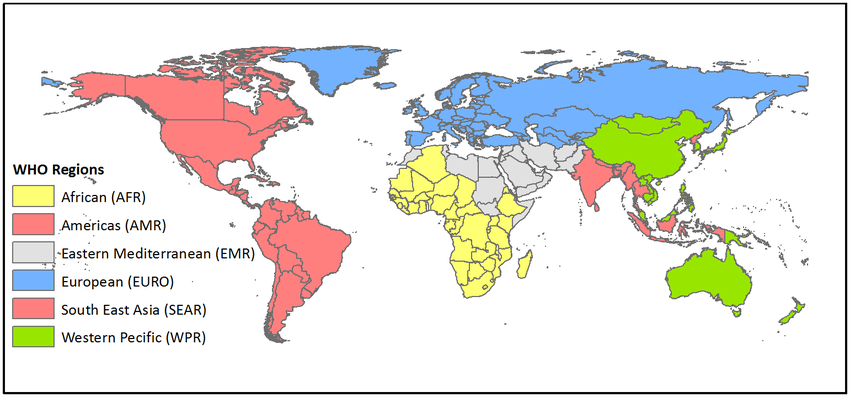

### EpiDataFuse:A generic faramework for collection, fusion and integration of spatio-temporal data for infectious disease surveillance

**EpiDataFuse Quickstart**

EpiDataFuse allows researchers to easily build pipelines for **collection, fusion and integration** of **spatio-temporal**(collected across both space and time) data for an ample of use cases such as online machine learning and for continuous prediction using computational models in application domains such as disease surveillance, climate science and epidemiology.

**Introduction to Spatio-temporal data and terminology**
1. **Spatio-temporal data**

Spatio-temporal data is collected across both **space** and **time**. Spatial refers to space and temporal refers to time. A spatio-temporal data point is only valid in a particular spatial context and a temporal context. For instance, consider the following data frame which depicts the new Coivd-19 cases in each **WHO region** from **October 26th  to November 9th** of 2020.

Figure 1.1: Data frame for covid cases

Figure 1.2: WHO Regions

As depicted above **record 0** is only valid in the   **Americas WHO region** and **record 1** is valid only in **Europe WHO region**. However, record 0 and 1 are both valid in the** week ending on Nov 2nd**.  In contrast, **record 0 **and **record 6** is valid in the **Americas WHO region**, but have different temporal contexts. The spatial and temporal context above is technically termed as granularity. In the above scenario, the number of covid-19 cases is the feature whereas the WHO region and the cumulative week(from Monday to Sunday) are respectively spatial and temporal granularities of the feature.

In the above instance, Americas, Europe, South East Asia, Eastern Mediterranean Africa and Western Pacific are granules of **WHO region** spatial granularity, whereas **Week 1(Nov2)**, **Week 2(Nov 9)** are granules of **Week** temporal granularity.

Above example depicts is only one type of spatio-temporal data where spatial locations/regions are treated as objects and measurements are collected over time to form features. This type of data is also known as **Raster data**. In addition, event data, trajectory data and point reference data are the other types of data which are summarized in a [survey](https://dl.acm.org/doi/10.1145/3161602) done by Atluri et al. **EpiDataFuse currently provide fusion mechanism for only raster data**as raster data is the type that is heavily used in applications such as disease surveillance.

2. **Spatio-temporal granularity**

As described above, spatio-temporal granularity is the spatial and temporal granularities(context of validity) of a particular data point. Further, multi-granular data are data which can be represented in multiple granularities. For instance, in the above example, the number of covid-19 cases is represented in  **WHO region spatial granularity** which is an aggregation of covid cases of **countries**, where **WHO region** is the coarser granularity and **country** is the finer granularity. Further, **Country** is a granularity which is an aggregation of **Districts or States **which can be further divided into locations of hospitals, labs, etc. As such, coarser granularities can be formed by aggregating finer granularities and finer granularities can be formed by dividing coarser granularities. The same applies to the temporal domain as well, which can easily be understood by the domain hierarchy of the temporal domain which is nanoseconds, microseconds, milliseconds, seconds, minutes, hours, days, etc.

3. **Spatial granularity**

In the spatial domain, granularity can be defined in terms of geometry using a spatial object type. The following table summarizes the primitive types of spatial objects with corresponding example spatial granularities.

<table>
  <tr>
   <td>Spatial object type
   </td>
   <td>Spatial granularity
   </td>
  </tr>
  <tr>
   <td><strong>Point</strong>
   </td>
   <td>
<ol>

<li>Airports

<li>Weather stations

<li>Train Stations

<li>Etc.
</li>
</ol>
   </td>
  </tr>
  <tr>
   <td><strong>Line</strong>
   </td>
   <td>
<ol>

<li>Roads

<li>Flight routes

<li>Train tracks

<li>Migration patterns of Animals

<li>Etc.
</li>
</ol>
   </td>
  </tr>
  <tr>
   <td><strong>Polygon</strong>
   </td>
   <td>Geopolitical regions and Administrative boundaries
<ol>

<li>Continent

<li>Country

<li>WHO Region 

<li>MOH Area

<li>Etc.
</li>
</ol>
   </td>
  </tr>
</table>

Multi-point, Multi-Line, Multi-Polygon are extensions of these primitive spatial objects that also used to define spatial granularities. For each granularity, there is a set of **granules**. For instance, if we consider **Airports in the world **as a granularity the set of airports around the globe forms the granules set for that particular granularity.

*   Los Angeles International Airport
*   Denver International Airport
*   [John F. Kennedy International Airport](https://www.world-airport-codes.com/united-states/john-f-kennedy-international-5202.html)
*   Etc.

One other example of granules is the Americas, Europe, South East Asia, Eastern Mediterranean Africa and Western Pacific regions depicted above in figure  1.2 to form MOH Region granularity.

**4. Temporal granularity**

In the temporal domain, the granularities can be considered the standardized units of measuring time which is known as the concept hierarchy of the temporal domain. Further, custom temporal granularities can be formed using standard units of measurement for the requirements of the application. Following table depicts some of the temporal granularities and granules of each granularity.

<table>
  <tr>
   <td>Temporal granularity
   </td>
   <td>Granules
   </td>
  </tr>
  <tr>
   <td>Second
   </td>
   <td>1, 2, 3, … , 60
   </td>
  </tr>
  <tr>
   <td>Minute
   </td>
   <td>1,2,3, … ,60
   </td>
  </tr>
  <tr>
   <td>Hour
   </td>
   <td>1,2,3, … , 24
   </td>
  </tr>
  <tr>
   <td>Day
   </td>
   <td>1,2,3, … , 31
   </td>
  </tr>
  <tr>
   <td>Week
   </td>
   <td>Mon, Tue, … , Sun
   </td>
  </tr>
  <tr>
   <td>Month
   </td>
   <td>Jan, Feb, … , Dec
   </td>
  </tr>
  <tr>
   <td>Quater
   </td>
   <td>1,2,3,4
   </td>
  </tr>
  <tr>
   <td>Year
   </td>
   <td>…,  2000, 2001, 2002, … , 2020, ...
   </td>
  </tr>
  <tr>
   <td>Season
   </td>
   <td>Spring, Summer, Fall, Winter
   </td>
  </tr>
</table>

When spatial and temporal granularities are combined it creates a spatio-temporal granularity which makes spatio-temporal data comparatively complex. Moreover, the spatio-temporal granularity is heterogeneous from feature to feature. Due to this heterogeneity, it very difficult to integrate data points of different features to generate new combined or summarized data points. The following section describes the process of integration of spatio-temporal data.

1. **Fusing and Integrating spatio-temporal data points**

   Fusion and integration of data points are performed to generate consumable data points. For instance, consider two data points **a1** and **b1** belonging to two different features A and B.  We can generate a new data point **c1** by Integrating **a1** and **b1**. Thereafter, the generated data point **c1** may be consumed by a computational model. However, integrating data points of two spatio-temporal features is more complex due to the deficient of spatial and temporal granularities in the two features. EpiDataFuse provides an abstract methodology to fuse and integrate spatio-temporal data,  eliminating the overhead of dealing with such complexity,

2. **Example scenario**

   Following example depicts a scenario of providing consumable data for an online machine learning model for predicting the spread of the covid-19.

    1. The Dataset
    2. Creating a fusion pipeline and configuring the pipeline
    3. Initialize the fusion pipeline and observe the results
    4. Addtional information
